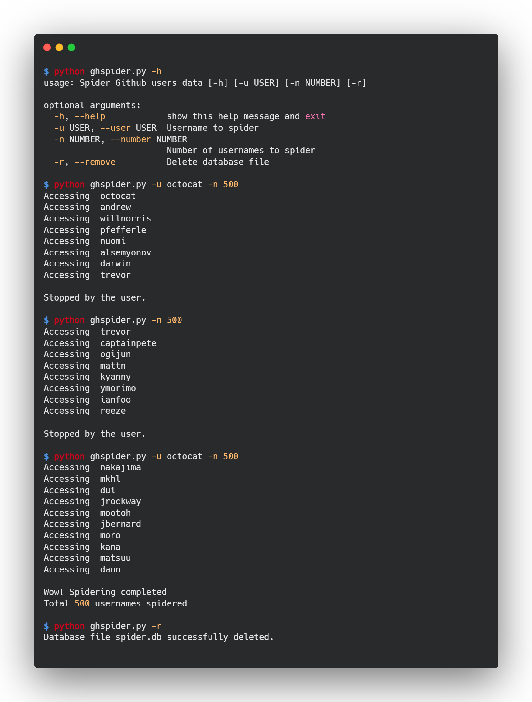

# Github Spider
Github Spider is a tool to spider Github users' data such as name, public repos count, followers count and following count using Github API and store the data into sqlite database.

## Dependencies
**Github Spider** depends on the following python modules:
* **requests** - https://docs.python-requests.org/en/latest/
* **argparse** - https://docs.python.org/3/library/argparse.html

## Installation
* Clone the repository:
```
git clone git@github.com:rjharishabh/github-spider.git
```

* Go to the github-spider folder:
```
cd github-spider
```

* Install the dependencies:
```
pip install -r requirements.txt
```

* [Generate **Personal Access Token** in Github](https://docs.github.com/en/authentication/keeping-your-account-and-data-secure/creating-a-personal-access-token) and add it in auth.py along with your Github username.

* Congrats, you have successfully installed **Github Spider**.

* Now, it's time to run the program.

## Usage
Short Form | Long Form | Description 
--- | --- | ---
-u | --user | Username to spider
-n | --number | Number of usernames to spider (default=250)
-r | --remove | Delete database file
-h | --help | Show the help message and exit

* Show help message
```
python ghspider.py -h
```

*  Start the program with username and number
```
python ghspider.py -u octocat -n 500
```

* Run the program without username, but with number
```
python ghspider.py -n 500
```

* Run the program without username and without number
```
python ghspider.py
```

* Run the program to delete database file
```
python ghspider.py -r
```



## Copyright
* (C) 2021 Rishabh Ranjan Jha (https://github.com/rjharishabh)
* Distributed under the GNU General Public License version 2
* See [License details](https://github.com/rjharishabh/github-spider/blob/d3779aa2dbe652789aac3caed4042447470760c5/LICENSE#L1)